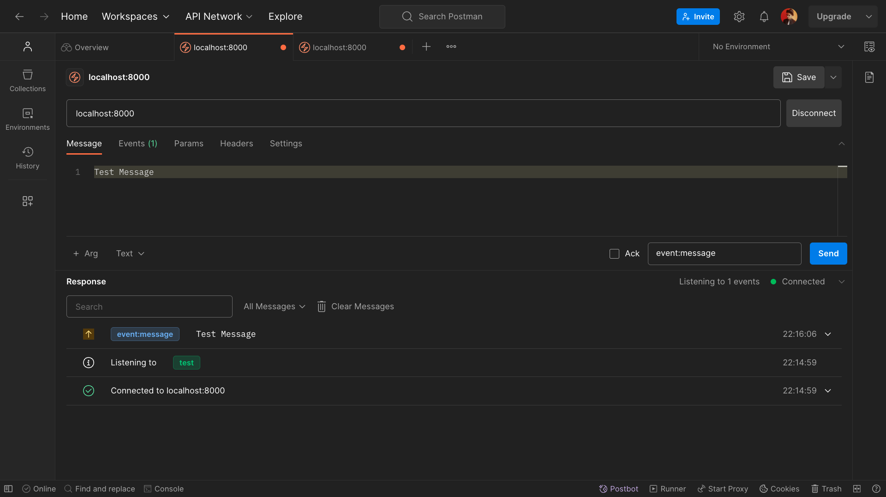

# WS + Redis + Node

> This is a simple example of sclaing Web Sockets using Redis.

### Architecture

```mermaid
flowchart BT
  subgraph Clients
    McTechie(Client 1)
    AnonUser2(Client 2)
    AnonUser3(Client 3)
    AnonUser4(Client 4)
  end

  subgraph Servers
    McTechie(Client 1) <-->|Socket Conn.| Server_1
    AnonUser2(Client 2) <-->|Socket Conn.| Server_1
    AnonUser3(Client 3) <-->|Socket Conn.| Server_2
    AnonUser4(Client 4) <-->|Socket Conn.| Server_2
  end

  subgraph Redis Pub/Sub Layer
    Server_1 <-->|Pub/Sub| Redis
    Server_2 <-->|Pub/Sub| Redis
  end
```

### How to run

> This project requires Node.js and Redis to run.

#### Part 1: Redis

> You can either install Redis locally or use Docker.
> I prefer using Docker.

```bash
# Directly via Docker
docker run -d --name CONTAINER_NAME -p 6379:6379 redis
```

#### Part 2: Server

```bash
# Clone the repository
git clone https://github.com/McTechie/redis-ws.git

# Change directory
cd redis-ws

# Install pnpm (Skip if already installed)
npm i -g pnpm

# Install dependencies
pnpm install

# Run the server
pnpm dev
```

### Demo

#### Client 1


#### Client 2


#### Message Broadcast [Client 1]



#### Message Received [Client 2]


#### Server Logs


