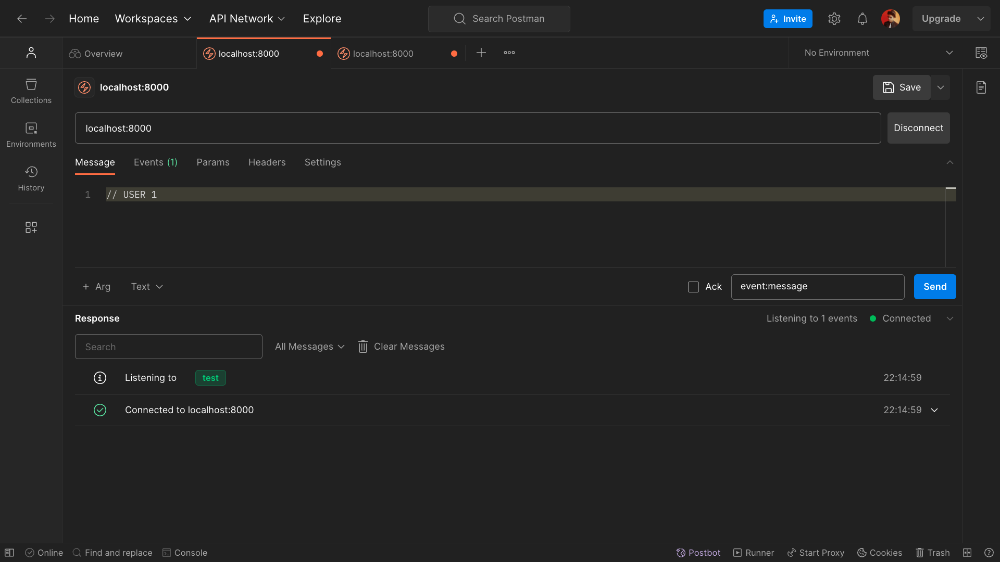
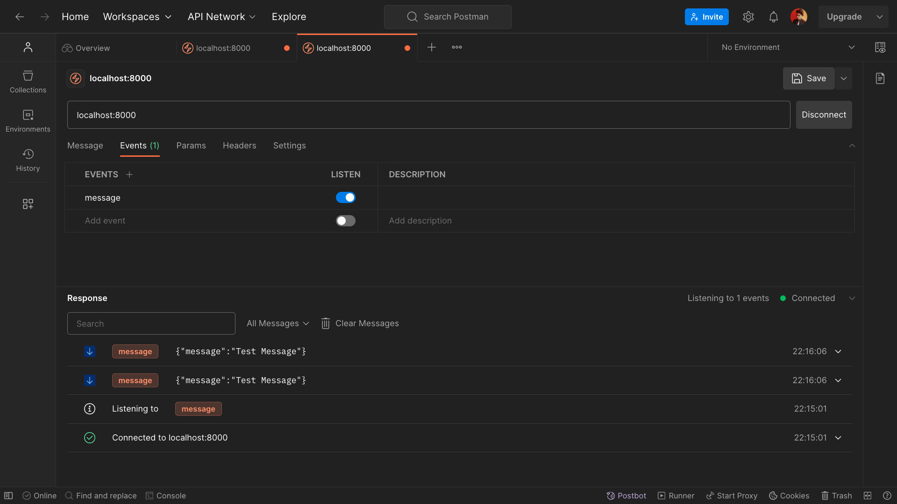
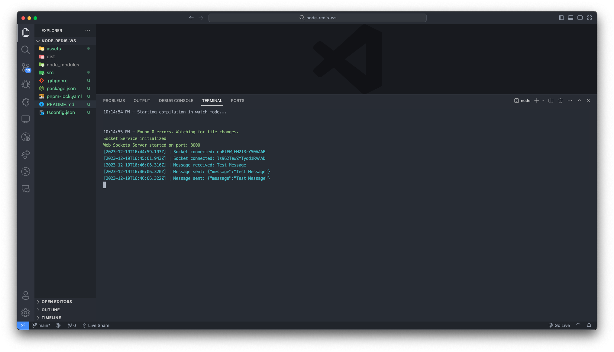

# Scalable Web Sockets | Redis + Kafka + Postgres

> This is a simple example of sclaing Web Sockets using Redis Pub/Sub, Kafka and Postgres.

### Architecture

```mermaid
flowchart LR
  subgraph Clients
    McTechie(Client 1)
    AnonUser2(Client 2)
    AnonUser3(Client 3)
    AnonUser4(Client 4)
    AnonUser5(Client 5)
  end

  subgraph Servers
    McTechie(Client 1) <-->|Socket Conn.| Server_1(Server 1)
    AnonUser2(Client 2) <-->|Socket Conn.| Server_1(Server 1)
    AnonUser3(Client 3) <-->|Socket Conn.| Server_1(Server 1)
    AnonUser4(Client 4) <-->|Socket Conn.| Server_2(Server 2)
    AnonUser5(Client 5) <-->|Socket Conn.| Server_2(Server 2)
  end

  subgraph Scaling Mechanism
    subgraph Pub/Sub Layer
      Server_1 <-->|Pub/Sub| Redis(Redis Service)
      Server_2 <-->|Pub/Sub| Redis(Redis Service)
    end

    subgraph Kafka Layer
      Server_1 -->|Produces| KafkaTopic(Kafka Topic)
      Server_2 -->|Produces| KafkaTopic(Kafka Topic)
      KafkaTopic <-->|Consumes| KafkaConsumer(Consumer Service)
      KafkaConsumer(Consumer Service) -->|Write| Postgres(Postgres DB)
    end
  end
```

### How to run

> This project requires Node.js, Redis, Kafka and Postgres to run.

#### Part 1: Redis & Kafka

> You can use Docker to run Redis and Kafka, or use a local / cloud service.

```bash
docker compose up -d
```

Don't forget to add the following environment variables in the `.env` file:

```bash
REDIS_URL=
```

#### Part 2: Postgres

> You can either use the Docker Compose Postgres container, or spin it up locally, or a third-party service.
> I've used Vercel's Postgres service.

Make sure to add the following environment variables in the `.env` file:

```bash
POSTGRES_URL=
POSTGRES_PRISMA_URL=
POSTGRES_URL_NON_POOLING=
POSTGRES_USER=
POSTGRES_HOST=
POSTGRES_PASSWORD=
POSTGRES_DATABASE=
```

#### Part 3: Server

```bash
# Clone the repository
git clone https://github.com/McTechie/redis-ws.git

# Change directory
cd scalable-websockets

# Install pnpm (Skip if already installed)
npm i -g pnpm

# Install dependencies
pnpm install

# Run the server
pnpm dev
```

### Demo

#### Client 1



#### Client 2


#### Message Broadcast [Client 1]


#### Message Received [Client 2]



#### Server Logs


